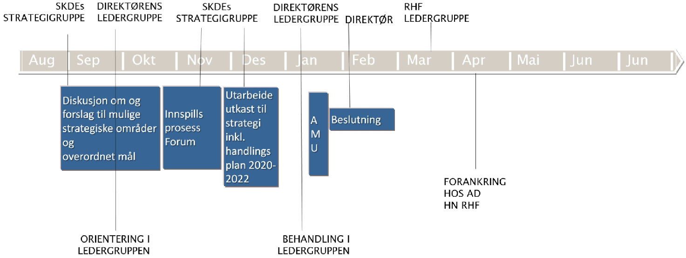
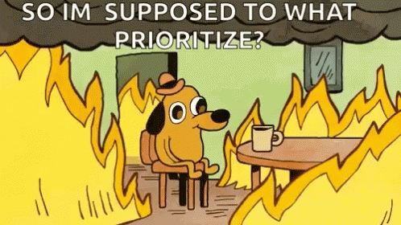
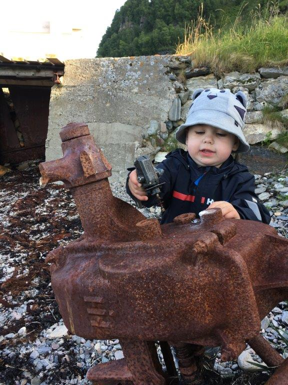
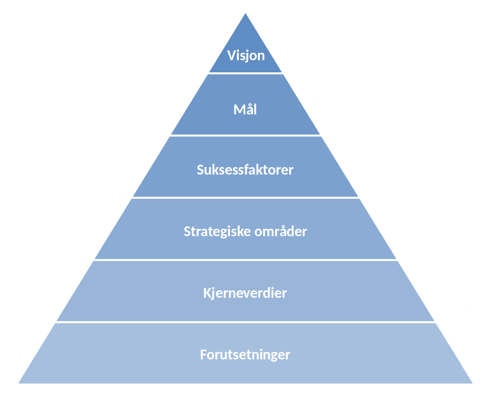

```{r setup, include=FALSE}
knitr::opts_chunk$set(echo = FALSE)
```

# Begrunnelse, prosess og tidsplan


## Endrede rammer for vår virksomhet {background-repeat="no-repeat"}

> - FHI – variasjon og helsetjeneste forskning
> - HDIR – variasjon i tjenester (psykiatri)
> - HN RHF – vår plass i organisasjonen
> - Ny organisering av ledelsen av kvalitetsregisterfeltet, _i.e_ mer avhengig av samarbeid med øvrige RHF
> - Andre har datagrunnlag som vi tradisjonelt ville hatt, _e.g._ psykiatri Helse Førde 


## Behov for  avklaringer internt i SKDE

> - Uklart hvordan forskningen skulle innplasseres i hele virksomheten
> - Ekstern finansiering av fremtidig forskning
> - Samordning av parallell kompetanse (statistikk/analyse)


## Omstillingsbehov i HN RHF

> - Økonomi
> - Organisering av fag, forskning og kvalitet


## Tidslinje {.center}



# Hva er strategi? <!-- HSB --> 

## Hva er strategien -- og hva er den ikke?
 <!-- .element height="50%" width="50%" -->


## Hvorfor lager vi en strategi?


## Hva kjennetegner en god strategi?

> Egnet til å videreutvikle og styrke dagens kjernevirksomhet


## Hva kjennetegner en god strategi?



## Hva kjennetegner en god strategi?

> Alle finner sitt arbeid igjen


## 


## Hva kjennetegner en god strategi?

> Konkrete mål!

> Én tydelig vei til målet!

> Forener gjennom et felles mål

> Inspirerer


## Hva kjennetegner en god strategi?


# To viktige presiseringer <!-- (HSB) -->


## Prosess i arbeidsgruppen

- Målsetting: å legge frem "noe" som et godt grunnlag for diskusjon og videre bearbeiding i hele SKDE
- Vanskelig å få dette til om ikke utkast til strategi er "fullstendig"


## Men husk, alt kan repareres!!!



# Rammeverk for en strategi -- til hjelp for tanken <!-- (PGP) -->


## 
 <!-- .element style="height='50%' width='50%'" -->


## Forutsetninger {data-background="https://raw.githubusercontent.com/areedv/strat/master/inst/figs/pyra_background.png" background-size="contain"}

Eksterne rammebetingelser


## Kjerneverdier {data-background="https://raw.githubusercontent.com/areedv/strat/master/inst/figs/pyra_background.png" background-size="contain"}

Hva skal vi stå for i SKDE?

        
## Visjon {data-background="https://raw.githubusercontent.com/areedv/strat/master/inst/figs/pyra_background.png" background-size="contain" .center}

- Hva er vi til for?
- Vårt oppdrag -- på lang sikt (2035)


## Mål  {data-background="https://raw.githubusercontent.com/areedv/strat/master/inst/figs/pyra_background.png" background-size="contain" .center}

- Der vi ønsker å være etter strategiperioden(e)
- Hva vi skal ha oppnådd


## Strategiske områder {data-background="https://raw.githubusercontent.com/areedv/strat/master/inst/figs/pyra_background.png" background-size="contain"}

- hvor vi har et gap mellom nåsituasjon og ønsket situasjon/mål
- hvor vi særskilt vil knytte aktiviteter og investeringer for å komme dit vi ønsker


## Suksessfaktorer {data-background="https://raw.githubusercontent.com/areedv/strat/master/inst/figs/pyra_background.png" background-size="contain"}

- Hva som skal til for at vi lykkes i å nå visjon og mål
- Faktorer som krever betydelig innsats i perioden(e)
- "Konkurransefortrinn"


##  {data-background="https://raw.githubusercontent.com/areedv/strat/master/inst/figs/pyra_background_concept_summary.png" background-size="contain"}


# Utkast til Strategi for SKDE <!-- (AE) -->

## Forutsetninger {data-background="https://raw.githubusercontent.com/areedv/strat/master/inst/figs/forut_bck.png" background-size="contain"}

- Lovgivning
- Regionale og nasjonale oppdrag
- Økonomiske rammebetingelser

## Våre kjerneverdier {data-background="https://raw.githubusercontent.com/areedv/strat/master/inst/figs/kjerne_bck.png" background-size="contain"}
- Hva er nå det da?
- Bør gi gjenklang hos alle, altså at alle kan idetifisere seg med verdiene som foreslås


## Visjon {data-background="https://raw.githubusercontent.com/areedv/strat/master/inst/figs/vis_bck.png" background-size="contain" .center}

> Pasientens beste


## Mål: bedre og mer likeverdige tjenester {data-background="https://raw.githubusercontent.com/areedv/strat/master/inst/figs/mal_bck.png" background-size="contain" .center}

> SKDE bidrar til å skape en bedre og mer likeverdig fordelt helsetjeneste i Norge gjennom analyser av og forskning på variasjon i omfang og kvalitet i helsetjenesten, og gjennom kunnskapsoverføring og beslutningsstøtte til forvaltning, helseledere, helsearbeidere og pasienter


##  {data-background="https://raw.githubusercontent.com/areedv/strat/master/inst/figs/pyra_background_ut_summary.png" background-size="contain"}

# Strategiske områder <!-- (HSB) -->


## Strategiske områder oppsummert {data-background="https://raw.githubusercontent.com/areedv/strat/master/inst/figs/strat_bck.png" background-size="contain"}
- Forskning
- Kunnskapsoverføring
- Beslutningsstøtte


## Strategisk område: forskning {data-background="https://raw.githubusercontent.com/areedv/strat/master/inst/figs/strat_bck.png" background-size="contain"}

> Vi styrker arbeidet med kvalitetsregistre og helseatlas, og utvikler derfor klinikknær helsetjeneste-forskning med kvantitativ og kvalitativ metode med data fra bla. medisinske kvalitetsregistre, NPR og andre nasjonale helse- og befolkningsregistre.

## Strategisk område forskning: mål {data-background="https://raw.githubusercontent.com/areedv/strat/master/inst/figs/strat_bck.png" background-size="contain"}

- Forskning på årsaker til variasjon i bruk og kvalitet i helsetjenesten som er nyttig i forbedringsarbeid, skal inngå som en integrert del av kjernevirksomheten i SKDE
- Skape handlingsrom gjennom ekstern finansiering


## Strategisk område: kunnskapsoverføring {data-background="https://raw.githubusercontent.com/areedv/strat/master/inst/figs/strat_bck.png" background-size="contain"}

> Vi stimulerer til økt bruk av resultater fra SKDE som grunnlag for forbedringsprosjekter i helseforetakene, og utvikler derfor nye og mer målrettede aktiviteter som tar sikte på kunnskapsoverføring til beslutningstakere på alle nivåer i helsetjenesten.


## Strategisk område kunnskapsoverføring: mål {data-background="https://raw.githubusercontent.com/areedv/strat/master/inst/figs/strat_bck.png" background-size="contain"}

- Sørge for at tilgjengelig styringsinformasjon, kunnskap om variasjon i helsetjenesten og kunnskap om forbedringsmetodikk når ut til beslutningstakere på alle nivåer i helsetjenesten


## Strategisk område: beslutningsstøtte {data-background="https://raw.githubusercontent.com/areedv/strat/master/inst/figs/strat_bck.png" background-size="contain"}

> Vi sikrer beslutningstakere i helsetjenesten tilgang til et kunnskapsgrunnlag av høy kvalitet, og styrker derfor vår analytiske kapasitet og utvikler et sterkt fagmiljø innen kvalitetsforbedrings-metodikk.


## Strategisk område beslutningsstøtte: mål {data-background="https://raw.githubusercontent.com/areedv/strat/master/inst/figs/strat_bck.png" background-size="contain"}

- Beholde og utvikle posisjonen som nasjonalt ledende innen kunnskap om medisinske kvalitetsregistre og NPR, som datakilder for kvalitetsforbedring og styringsinformasjon
- Utvikle kompetansen på og prosedyrene for bruk av andre helseregistre samt koblede datasett, som datakilder for kvalitetsforbedring og - styringsinformasjon


##  {data-background="https://raw.githubusercontent.com/areedv/strat/master/inst/figs/pyra_background_strat_summary.png" background-size="contain"}


# Suksessfaktorer <!-- (HT) -->


## Suksessfaktorer oppsummert {data-background="https://raw.githubusercontent.com/areedv/strat/master/inst/figs/suk_bck.png" background-size="contain"}
- Funksjonell bruk av ressurser
- Fremtidsrettet kompetanse
- Nærhet til helsetjenesten


## Suksessfaktor: funksjonell bruk av ressurser {data-background="https://raw.githubusercontent.com/areedv/strat/master/inst/figs/suk_bck.png" background-size="contain"}

> - Vi har tydelig prioritering mellom oppgaver og god oppgavefordeling
> - Vi har optimalisert og situasjonsbetinget bruk av den samlede analyse- og statistikerkapasiteten
> - Vi har optimalisert og samordnet bruk av stabsressursene
> - Vi har en tverrfaglig arbeidsgruppe for en ny formidlingsportal
> - Vi har en  tverrfaglig arbeidsgruppe for å utvikle kunnskap om metoder for kvalitetsforbedring


## Suksessfaktor: fremtidsrettet kompetanse {data-background="https://raw.githubusercontent.com/areedv/strat/master/inst/figs/suk_bck.png" background-size="contain"}

> - Vi er en lærende organisasjon, der ansatte har tid og rom for utforsking av nye ideer og verktøy
> - Vi er en nyskapende organisasjon der endring skapes av ansatte i et faglig felleskap og nye ideer har gode vekstvilkår
> - Vi tilbyr kompetanseheving gjennom kurs, etterutdanning, master- og PhD-utdanning
> - Vi sikrer pålitelig databehandling gjennom god helseregisterkompetanse og nærhet til helsetjenesten


## Suksessfaktor: nærhet til helsetjenesten {data-background="https://raw.githubusercontent.com/areedv/strat/master/inst/figs/suk_bck.png" background-size="contain"}

> - Vi er en sentral aktør i et samordnet og koordinert fagmiljø som består av medlemmer i referansegrupper for helseatlas og virksomhetsanalyser, samt medlemmer i kvalitetsregistrenes og SKDEs fagråd
> - Vi har et kompetent og tverrfaglig brukerforum for SKDE som aktivt brukes til egen forbedring og utvikling
> - Vi bruker den kontakten vi har med sentrale fagfolk i arbeidet  med å formidle  resultater


##  {data-background="https://raw.githubusercontent.com/areedv/strat/master/inst/figs/pyra_background_suk_summary.png" background-size="contain"}


# Strategiske mål og tiltak (Handlingsplan?) <!-- (HSB) -->


## Strategisk område: forskning {data-background="https://raw.githubusercontent.com/areedv/strat/master/inst/figs/strat_bck.png" background-size="contain"}

> Forskning på årsaker til variasjon i bruk og kvalitet i helsetjenesten som er nyttig i forbedringsarbeid, skal inngå som en integrert del av kjernevirksomheten i SKDE


## Strategisk område forskning: tiltak {data-background="https://raw.githubusercontent.com/areedv/strat/master/inst/figs/strat_bck.png" background-size="contain"}

> - Utvikle forskningsstøttet helseatlas med bruk av flere datakilder
> - Prioritere og tilrettelegge for forskningssamarbeid med kvalitetsregistre
> - Etablere rutiner  for mest mulig effektiv tilgang til data fra for eksempel NPR, KPR/KUHR, kvalitetsregistre, SSB
> - Utvikle forskningsnettverk: identifisere og etablere formelt samarbeid med sentrale nasjonale og internasjonale miljø.


## Strategisk område: forskning {data-background="https://raw.githubusercontent.com/areedv/strat/master/inst/figs/strat_bck.png" background-size="contain"}

> Skape handlingsrom gjennom ekstern finansiering

Tiltak:

> - Etablere en kontinuerlig prosess for prosjektutvikling i hele avdelingen 
> - Etablere en ide/prosjektbank til student/masteroppgaver
> - Søke på alle relevante nasjonale utlysninger av forskningsmidler


## Strategisk område: kunnskapsoverføring {data-background="https://raw.githubusercontent.com/areedv/strat/master/inst/figs/strat_bck.png" background-size="contain"}

> Sørge for at tilgjengelig styringsinformasjon, kunnskap om variasjon i helsetjenesten og kunnskap om forbedringsmetodikk når ut til beslutningstakere på alle nivåer i helsetjenesten


## Strategisk område kunnskapsoverføring: tiltak  {data-background="https://raw.githubusercontent.com/areedv/strat/master/inst/figs/strat_bck.png" background-size="contain"}

> - Bringe målrettet og tilpasset  informasjon til hvert enkelt HF, RHF og nasjonale helsemyndigheter
> - Arbeide for at forbedrings-kunnskap/metodikk tas opp i alle kvalitetsregistre
> - Delta aktivt i relevante faglige fora/møteplasser/tidsskrift
> - Bidra aktivt med kunnskapsformidling  i den offentlige debatt
> - Utvikle retorikk og et narrativ i vår formidling som gjør at kunnskapen aksepteres og  brukes
> - Utvikle en portal for presentasjon av nøkkelresultater for styring og kvalitetsforbedring
> - Forenkle rapporteringsrutiner for kvalitetsregistrene  --  selvangivelsmodell


## Strategisk område: beslutningsstøtte  {data-background="https://raw.githubusercontent.com/areedv/strat/master/inst/figs/strat_bck.png" background-size="contain"}

> Beholde og utvikle posisjonen som nasjonalt ledende innen kunnskap om medisinske kvalitetsregistre og NPR, som datakilder for kvalitetsforbedring og styringsinformasjon

> Utvikle kompetansen på og prosedyrene for bruk av andre helseregistre samt koblede datasett, som datakilder for kvalitetsforbedring og - styringsinformasjon

## Strategisk område beslutningsstøtte: tiltak
    
> - Styrke miljøet for analysestøtte basert på registerdata
> - Markere SKDE i nasjonale nettverk/arbeidsgrupper
> - Utvikle et sterkt miljø for kunnskap om metoder for kvalitetsforbedring
> - Identifisere og utforme relevant styringsinformasjon
 

##  {data-background="https://raw.githubusercontent.com/areedv/strat/master/inst/figs/pyra_background_all_summary.png" background-size="contain"}
