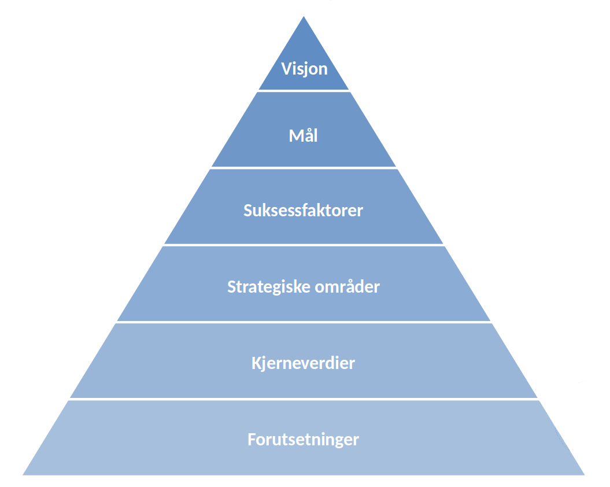

```{r setup, include=FALSE}
knitr::opts_chunk$set(echo = FALSE)
```

# Rammer for prosess og tidsplan -- samt kake (BV)

## Men hvorfor..? {background-repeat="no-repeat"}
Legges frem av BV


## Hvem har jobbet med dette?
asdf


## Tidslinje
sdfsa


# Hva er strategi? (HS)

## Hva er strategien -- og hva er den ikke?
 <!-- .element height="50%" width="50%" -->


## Hvorfor lager vi en strategi?


## Hva kjennetegner en god strategi (kulepunkter)?

## Hva kjennetegner en god strategi?


## Hva kjennetegner en god strategi?


## Hva kjennetegner en god strategi (mulig kulepunkter)?

## Hva kjennetegner en god strategi?


# To viktige presiseringer


## Prosess i arbeidsgruppen

- Målsetting: å legger frem "noe" som et godt grunnlag for diskusjon og videre bearbeiding i hele SKDE
- Vanskelig å få dette til om ikke utkast til strategi er fullstendig


## Men husk, alt kan repareres!!!


# Rammeverk for en strategi (PGP)


## Til hjelp for tanken
<!-- .element height="50%" width="50%" -->


## Forutsetninger {data-background="https://raw.githubusercontent.com/areedv/strat/master/inst/figs/pyra_background_trans.png" background-size="contain"}

Eksterne rammebetingelser


## Kjerneverdier {data-background="https://raw.githubusercontent.com/areedv/strat/master/inst/figs/pyra_background.png" background-size="contain"}

Hva skal vi stå for i SKDE?

        
## Visjon {data-background="https://raw.githubusercontent.com/areedv/strat/master/inst/figs/pyra_background.png" background-size="contain" .center}

- Fremtidens målbilde
- Vårt oppdrag -- på lang sikt (2035)


## Mål  {data-background="https://raw.githubusercontent.com/areedv/strat/master/inst/figs/pyra_background.png" background-size="contain" .center}

- Der vi ønsker å være etter strategiperioden(e)
- Hva vi skal ha oppnådd


## Strategiske områder {data-background="https://raw.githubusercontent.com/areedv/strat/master/inst/figs/pyra_background.png" background-size="contain"}

- hvor vi har et gap mellom nåsituasjon og ønsket situasjon/målbilde
- hvor vi særskilt vil knytte aktiviteter og investeringer for å komme dit vi ønsker


## Suksessfaktorer {data-background="https://raw.githubusercontent.com/areedv/strat/master/inst/figs/pyra_background.png" background-size="contain"}

- Hva som skal til for at vi lykkes i å nå visjon og mål
- Faktorer som krever betydelig innsats i perioden(e)
- "Konkurransefortrinn"


# Utkast til Strategi for SKDE

## Forutsetninger

- Lovgivning
- Regionale og nasjonale oppdrag
- Økonomiske rammebetingelser

## (Våre) Kjerneverdier
- Hva er nå det da?
- Må gjelde for alle, ala alle må kunne idetifiserer seg med verdiene som foreslås


## Strategiske områder (HSB)

- Forskning
- Kunnskapsoverføring
- Beslutningsstøtte

...og dette kommer vi tilbake til om tida strekker til


## Strategisk område: forskning

> Vi skal styrke arbeidet med kvalitetsregistre og helseatlas, og utvikler derfor klinikknær helsetjeneste-forskning med kvantitativ og kvalitativ metode med data fra bla. medisinske kvalitetsregistre, NPR og andre nasjonale helse- og befolkningsregistre.


## Strategisk område: kunnskapsoverføring

> Vi skal stimulere til økt bruk av resultater fra SKDE som grunnlag for forbedringsprosjekter i helseforetakene, og utvikler derfor nye og mer målrettede aktiviteter som tar sikte på kunnskapsoverføring til beslutningstakere på alle nivåer i helsetjenesten.


## Strategisk område: beslutningsstøtte

> Vi skal sikre beslutningstakere i helsetjenesten tilgang til et kunnskapsgrunnlag av høy kvalitet, og styrker derfor vår analytiske kapasitet og utvikler et sterkt fagmiljø innen kvalitetsforbedrings-metodikk.


## Suksessfaktorer (HT)

- Funksjonell organisering
- Fremtidsrettet kompetanse
- Nærhet til helsetjenesten

...og dette kommer vi tilbake til om tida strekker til

## Kulepunktene (og ikke strek)


## Mål: bedre og mer likeverdige tjenester (før suksess) (AE)

> SKDE skal bidra til å skape en bedre og mer likeverdig fordelt helsetjeneste i Norge gjennom analyser av og forskning på variasjon i omfang og kvalitet i helsetjenesten, og gjennom kunnskapsoverføring og beslutningsstøtte til forvaltning, helseledere, helsearbeidere og pasienter


## Visjon  (før suksess) (AE)

> Pasientens beste


## [And now, the nitty gritty details...]

- [Ved behov/om tid benyttes detaljer fra arbeidsgruppens diskusjoner]
- [Her er suksessfaktorer og strategiske områder i motsatt rekkefølge. Skal det være slik? JA]


## Suksessfaktorer: funksjonell orgasnisering

> - God intern samordning og oppgavefordeling gjennom tydelig prioritering av oppgaver
> - Optimalisert og situasjonsbetinget bruk av den samlede analysekapasiteten
> - Optimalisert og samordnet bruk av stabsressursene
> - Et samlet analysemiljø 
> - En tverrfaglig arbeidsgruppe for en ny formidlingsportal/plan 
> - En tverrfaglig arbeidsgruppe for å utvikle kunnskap om metoder for kvalitetsforbedring


## Suksessfaktorer: fremtidsrettet kompetanse

> - Vi er en lærende organisasjon, der ansatte har tid og rom for utforsking av nye ideer og verktøy
> - Vi er en innovativ og endringsvillig organisasjon der nye ideer-….nåkka?
> - Hvor kompetente skal forskerne våre være --- hvilken kompetanse skal vi styre mot etter oppnådd PhD?  professorkompetente? 1. aman komp?
> - Intern opplæring/kompetanseoverføring
> - Formell kompetanseheving (nye doktorgrader/mastergrader)
> - Deltakelse på eksterne kurs ved behov
> - God helseregisterkompetanse 
> - Pålitelig databehandling?


## Suksessfaktorer: nærhet til helsetjenesten

> - Vi er en sentral aktør i et samordnet og koordinert fagmiljø som fungerer som støtte for(?) kvalitetsregistrene og referansegrupper for helseatlas og virksomhetsanalyser
> - Vi har et kompetent og tverrfaglig brukerforum for SKDE som aktivt brukes til forbedring og utvikling
> - Vi bruker den kontakten vi har med sentrale fagfolk i arbeidet  med å formidle  resultater


## Skal dette med videre? (sto under databehandling)
- Ivareta og utvikle faglighet, grundighet, edruelighet og åpenhet  i vår databehandling
- Ivareta og utvikle engasjementet og viljen til å støtte opp om de som er avhengige av oss 


## Strategisk område: forskning

> Forskning på årsaker til variasjon i bruk og kvalitet i helsetjenesten som er nyttig i forbedringsarbeid, skal inngå som en integrert del av kjernevirksomheten i SKDE

Herunder:


## Strategisk område: forskning, forts.

> - Utvikle forskningsstøttet helseatlas med bruk av flere datakilder
> - Prioritere og tilrettelegge for forskningssamarbeid med kvalitetsregistre
> - Etablere rutiner  for mest mulig effektiv tilgang til data fra for eksempel NPR, KPR/KUHR, kvalitetsregistre, SSB
> - Utvikle forskningsnettverk: identifisere og etablere formelt samarbeid med sentrale nasjonale og internasjonale miljø.


## Strategisk område: forskning, forts.

> Skape handlingsrom gjennom ekstern finansiering

> - Etablere en kontinuerlig prosess for prosjektutvikling i hele avdelingen 
> - Etablere en ide/prosjektbank til student/masteroppgaver
> - Søke på alle relevante nasjonale utlysninger av forskningsmidler


## Strategisk område: kunnskapsoverføring

> Sørge for at tilgjengelig styringsinformasjon, kunnskap om variasjon i helsetjenesten og kunnskap om forbedringsmetodikk når ut til beslutningstakere på alle nivåer i helsetjenesten

Herunder:


## Strategisk område: kunnskapsoverføring, forts.

> - Bringe målrettet og tilpasset  informasjon til hvert enkelt HF, RHF og nasjonale helsemyndigheter
> - Arbeide for at forbedrings-kunnskap/metodikk tas opp i alle kvalitetsregistre
> - Delta aktivt i relevante faglige fora/møteplasser/tidsskrift
> - Bidra aktivt med kunnskapsformidling  i den offentlige debatt
> - Utvikle retorikk og et narrativ i vår formidling som gjør at kunnskapen aksepteres og  brukes
> - Utvikle en portal for presentasjon av nøkkelresultater for styring og kvalitetsforbedring
> - Forenkle rapporteringsrutiner for kvalitetsregistrene  --  selvangivelsmodell


## Strategisk område: beslutningsstøtte
- Beholde og utvikle posisjonen som nasjonalt ledende innen kunnskap om medisinske kvalitetsregistre og NPR, som datakilder for kvalitetsforbedring og styringsinformasjon
    - Styrke miljøet for analysestøtte basert på registerdata
    - Markere SKDE i nasjonale nettverk/arbeidsgrupper
    - Utvikle et sterkt miljø for kunnskap om metoder for kvalitetsforbedring
    - Identifisere og utforme relevant styringsinformasjon
- Utvikle kompetansen på og prosedyrene for bruk av andre helseregistre samt koblede datasett, som datakilder for kvalitetsforbedring og - styringsinformasjon

# Strategiske mål og tiltak

## Kule og strek