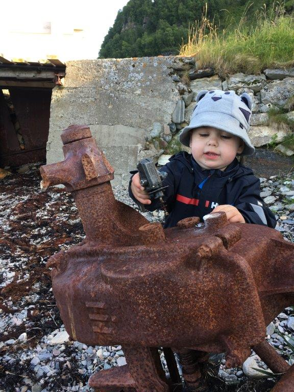

```{r setup, include=FALSE}
knitr::opts_chunk$set(echo = FALSE)
```

# Rammer for prosess og tidsplan -- samt kake

## Men hvorfor..?
Legges frem av BV

## Hva er strategien -- og hva er den ikke?


## Hvorfor lager vi en strategi?


## Hva kjennetegner en god strategi?


## Hva kjennetegner en god strategi?


## Hva kjennetegner en god strategi?


# To viktige presiseringer

## Alt kan repareres!!!


## Rammeverk -- til hjelp for tanken

## Til hjelp for tanken


# Tredje bolk 

## Konsept 

## Diskusjon 

## Hva vi har tenkt og gjort 
